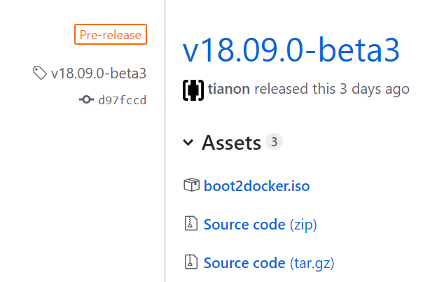
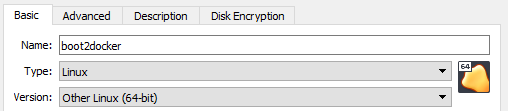
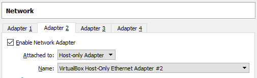
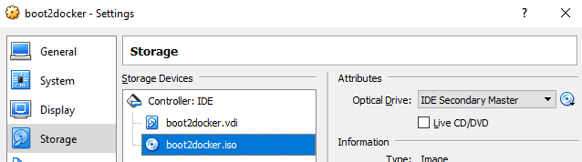

= Boot2Docker get start

== Download boot2docker

https://github.com/boot2docker/boot2docker/releases

.downlaod the newest release

== Create new VM

 >4Gb Memory, 8Gb Harddisk
 
.Network Adapter 2 as Host-only Adapter 

=== Input boot2docker-iso

== start the Machine

 user: docker
 pass: tcuser

=== Set Keyboard Layout

 su docker
 tce-load -wi kmaps
 sudo loadkmap < /usr/share/kmap/qwertz/de-latin1.kmap
 
 