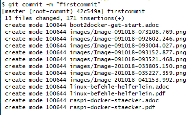
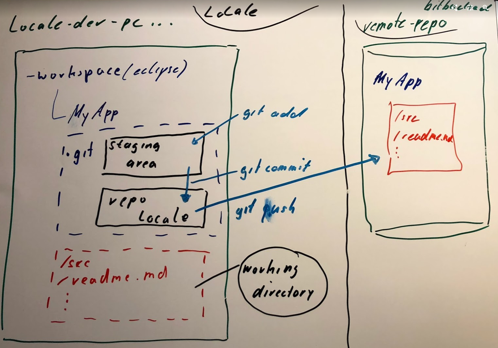

= Handouts to Github

== init local Repository

In das Verzeichnis wechseln welches Versioniert werden soll.

.lokales GIT Repository wird angelegt
 git init
 
.alle Dateien in die Stage bringen
 git add --all
 
.Stage Dateien in das lokale Repo commiten
 git commit -m "first commit" 
 
.Dateien erstmalig in das lokale Repo speichern

.dem Projekt das github Remote Repository bekannt machen
 git remote add origin https://github.com/Andreasman/[reponame]

.Dateien auf github pushen
 git push origin master
 
.Struktur von GIT
