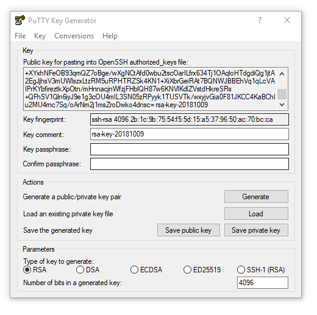

= Linux / MYSQL Befehle

== MySql

=== Ubuntu installieren

.Minimal Ubuntu download (Network installation)
 https://help.ubuntu.com/community/Installation/MinimalCD
 
VM mit der _mini.iso_ booten und System installieren. (ca. 10 Min)

* Arbeitsspeicher 6Gb
* HD ca. 30Gb
* Videospeicher 128Mb
* 4 Processoren
* Gast Additions
einlegen und installieren
* Share Laufwerk einstellen
* Copy Paste erlauben

.Anleitung install mysql and workbench
 https://www.youtube.com/watch?v=ug0TFsort24

.root password set
 sudo passwd

 

[TIP]
====
Nach der Grundinstallation ein Snapshot erstellen.
====

=== Mysql und Workbench installieren

.mysql installieren
 su
 apt update
 apt upgrade
 apt install mysql-server
 
.Berechtigungen einstellen, db sicherer machen...
 su
 mysql_secure_installation
 
 
 
.root user einstellen
 mysql -u root -p
 use mysql;
 update user set plugin='mysql_native_password' where User='root';
 update mysql.user set authentication_string=PASSWORD('root') where user='root';
 flush privileges;

.Workbench installieren
 apt install mysql-workbench

=== DB überprüfen

.Alle Datenbanken ausgeben
 show databases;

.Status aller Tabellen
 show table status from FlughafenDB;

.Stresstest (nicht im Betrieb!)
 mysqlslap --user=root -p --auto-generate-sql --concurrency=15 --number-of-queries=10000
 
.Status des Servers
 use INFORMATION_SCHEMA;
 SHOW STATUS;

== Linux

=== System überprüfen

.Systemauslastung
 top
 
.Speicherauslastung (**h**uman, nur **l**okale)
 df -hl
 
.hostnamen feststellen
 cat /etc/hostname
 
.Blockgeräte auflisten
 lsblk

.Laufzeit des Systems
 uptime

.Welches Betriebssystem
 uname -a

.Welches Release
 lsb_release -a
 
.Weitere Informationen
 cd /proc/
 cat meminfo | less
 
 
== Dateisystem, -verwaltung

[width="100%"]
|====================
| cp    |  Kopieren von Dateien und Verzeichnissen
| ls    | Auflisten von Dateien (-l = langform, -a = auch versteckte)
| rm    | löschen von Dateinen und Verzeichnissen 
| pwd   | aktuelles Verzeichnis  
|  |  
|  |  
|====================

 
.Dateiwerkzeuge
[width="100%",options="header"]
|====================
| Befehl    | Beschreibung 
| diff      | Vergleich des Inhalts zweier Dateien 
| grep      | durchsuchen von Dateien 
| rename    | umbenennen von Dateien 
| tail      | ausgabe der letzten 10 Zeilen einer Datei (-n Anzahl, -f "live Anzeige") 
| xx | xx 
|====================

== SSH

=== SSH-Anmeldung ohne Passwort

Mit Puttygen die Keys generieren.

