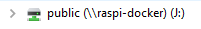
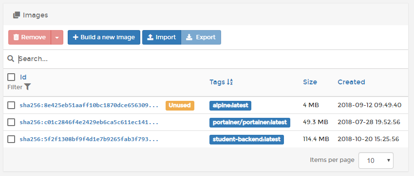
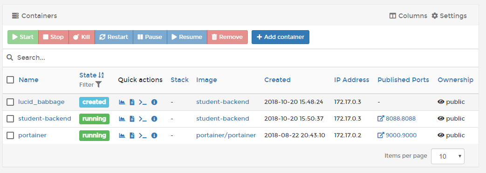
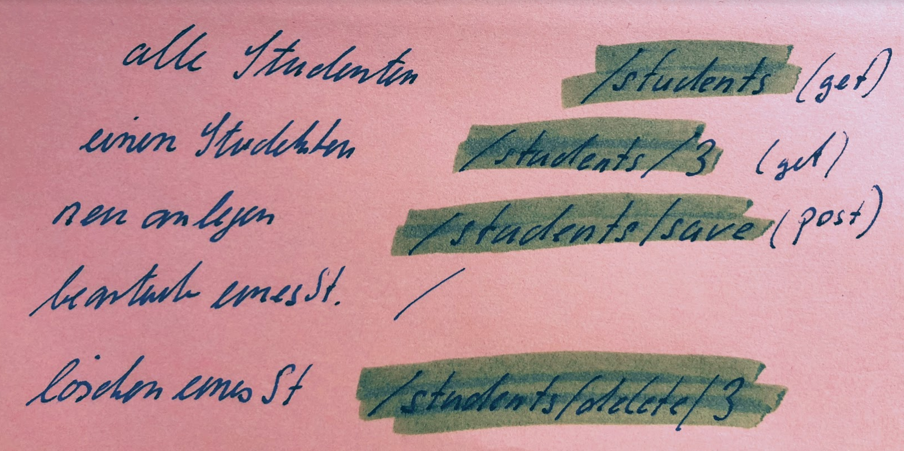

= Raspi-Docker

.hostname
 raspi-docker
 
.samba Austauschlaufwerk
 /media/public/
 
.Laufwerk in Windows

 
 
In dieses Austauschlaufwerk lege ich das aktuelle jar-file. Zum Beispiel _student-backend.jar_ für den Rest-Service.

Diese Datei muss dann in das Docker-Projekt-Verzeichnis kopiert werden.

 
.portainer Adresse
 http://raspi-docker:9000
 http://staecker.dyndns.org:9000/#/auth
 

== Java Application, Rest-Service "Student-Backend"

Dockerordner liegt unter

 /home/pirate/docker-projects/student-backend/
 
Hier liegt auch das Dockerfile.

.Dockerfile
[source,]
----
FROM library/alpine // <1>
RUN mkdir /myVol // <2>

ENV TZ="Europe/Berlin"

LABEL maintainer "staecker@t-online.de"
LABEL description "Image for Spring Boot Rest Services"

EXPOSE 8088 // <3>

RUN apk update
RUN apk  add openjdk8-jre // <4> 
RUN apk add --no-cache openssh
RUN apk add bash

WORKDIR /
# COPY /media/public/student-backend.jar /myVol/student-backend.jar
# CMD ["java", "-jar", "/media/public/student-backend.jar"]
CMD ["java", "-jar", "/myVol/student-backend.jar"] // <5>

----

<1> Basisimage, welches verwendet wird
<2> Verzeichnis erstellen als später verwendeter mountpoint
<3> Port, welcher nach aussen gereicht wird
<4> Java Runtime installieren
<5> Java Applikation starten

=== Image File aus Dockerfile erzeugen

.in das Docker-Projekt-Verzeichnis wechseln
 cd /home/pirate/docker-projects/student-backend/

.Image aufgrund des Dockerfiles erzeugen
 docker build -t student-backend .

.Image sollte im portainer zu sehen sein

=== Container starten

 docker run --name student-backend --mount source=student-manager,target=/myVol -p 8088:8088 student-backend
 docker run --name student-backend -v /media/public:/myVol -p 8088:8088 student-backend

 docker run -v /host/directory:/container/directory

.container sollte in portainer zu sehen sein und laufen 

=== Rest Service nutzen

.alle Studenten abrufen (get)
 staecker.dyndns.org:8088/students
 
.einen Studenten abrufen (get mit Parameter)
 staecker.dyndns.org:8088/students/3
 
.einen neuen Studenten anlegen (POST)
 staecker.dyndns.org:8088/students/save

.json im Body für den neuen Studenten
[source,]
----
 {
    "firstname": "Bernd",
    "lastname": "Stromberg"
 }

----
 
 

== Internetseiten zum Thema Docker

https://hub.docker.com/ Eine Auswahl von offiziellen und privaten Dockerimages.

=== Bücher

